import FullWidthImage from "../../components/FullWidthImage.astro";
import a11yBlueline from "../../assets/images/aqua-design-system/a11y-blueline.webp";
import colorSystem from "../../assets/images/aqua-design-system/color-system.webp";
import inputsFuture from "../../assets/images/aqua-design-system/inputs-future.webp";

## Overview

CBORD and Horizon Software are sister companies (with shared management) that make ~50+ different applications focused in the higher education, healthcare, senior living, and k-12 markets. Even though our products are all built by the same company, they sometimes look vastly different from one another due to the historically siloed company structure. This design system is an attempt to unify and standardize all products at CBORD and Horizon Software.

## Developer Style Guide

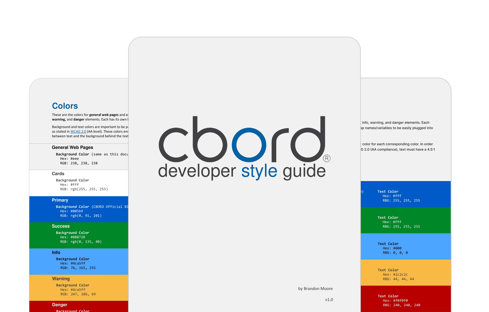
*Preview of the Developer Style Guide*

I think of this style guide as a first draft to the Aqua Design System. When I first started at CBORD there were virtually zero guidelines for design across the 5+ teams at the company. As an intern, I created a PDF style guide to create some alignment between all the teams. I wrote guidelines for the following topics:
- Color
- Typography
- Buttons
- Tone and Voice
- Iconography
- CSS Guidelines (i.e. use Sass and ABEM)

This style guide had varying levels of success from team to team. Most teams did align with the new color palette, but adoption was mostly up to the product owner for that team and prioritizing my style guide and its recommendations weren't necessarily at the top of their list of priorities.

## Aqua Design System

No design system can be created alone, and ALL of the upcoming designs or guidelines were created in collaboration with developers, product people, and other designers.

## Process

Our process involves constant feedback from the product team, other designers, developers, and stakeholders. Generally, our process is as follows:
- Figma for design and collaboration
- zeroheight for documentation
- Ionic (Angular) for development

I spend most of my time in Figma, designing the components, and in Zeroheight, writing documentation. I occasionally contribute to the development of component — specifically with CSS, accessibility, and animation.

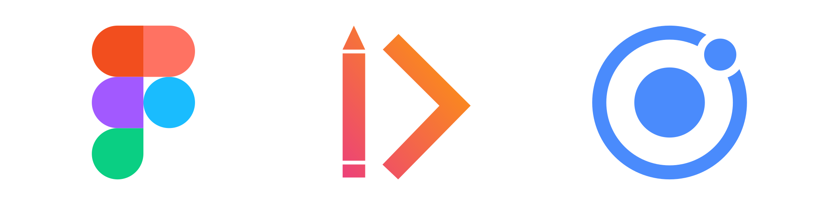
*Figma, zeroheight, and Ionic*

## Accessibility Guidelines

We meet WCAG 2.1 at a minimum of AA compliance, but strive for AAA compliance. I wrote many of the accessibility guidelines. Often times I will demo tools that I use that can make accessibility easier to understand:
- [NVDA](https://www.nvaccess.org/download/)
- [Siteimprove Accessibility Checker](https://chrome.google.com/webstore/detail/siteimprove-accessibility/efcfolpjihicnikpmhnmphjhhpiclljc)
- [WAVE](https://wave.webaim.org/extension/)
- [Stark](https://www.getstark.co/)

These tools help developers and designers when designing or developing specific components, but can also help when evaluating an entire product.

## Accessibility Bluelines

Providing accessibility bluelines (annotations), is a helpful way to ensure that critical behaviors and content are not lost during handoff from one discipline to another when creating/working with components in the Aqua Design System.

<FullWidthImage src={a11yBlueline} alt="Accessibility Blueline Annotation Components for the Aqua Design System" caption="Accessibility Blueline Annotation Components for the Aqua Design System" />

## Color

Creating a color palette that is both aesthetic and accessible was a bit of a challenge. We ultimately ended up creating our color palette based on CIELAB color space. This color palette took inspiration from an [excellent article by Stripe](https://stripe.com/blog/accessible-color-systems) that explains how their team went about creating an accessible color palette.

Because this design system is shared across both CBORD and Horizon Software we've opted to share all colors except for the primary (brand) color. This ability to swap the primary color also makes white-labeling products much easier for the products that require it.

<FullWidthImage src={colorSystem} alt="Aqua Design System color palette with swatches in order by CIELAB level" caption="Color System" />

## Inputs

Our inputs are inspired by Google's Material outlined text fields, with a higher emphasis on accessibility specifically for keyboard-only users.

For a keyboard-only user, it's important to have consistent and predictable focus states for every element that can be interacted with. One of the issues with an input that's in an error state is that when it's focused, there isn't usually any indication, as it's already in an error state. We decided to have a default error state and a focused error state. Each focus state has a 2dp border and a higher font weight for the label so that we aren't relying on just color alone to indicate focus.

There's also a diamond-shaped error icon that appears when the inputs are in an error state. We found this icon to be a good place to indicate the input is in an error state to screen reader users. It also acts as a non-color indication for colorblind users.

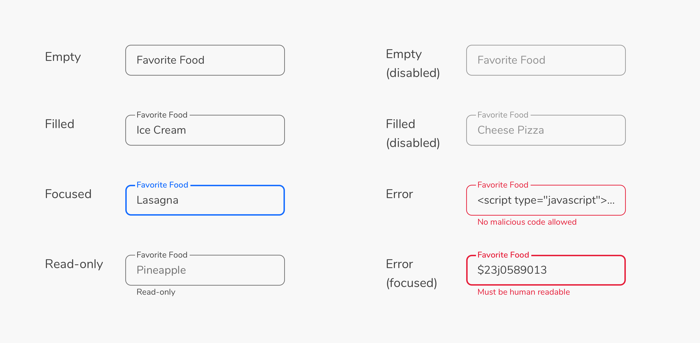
*Current Aqua Design System Input States*

### Looking forward

I'll be the first to admit we got it wrong. I'd like to see us move away from floating labels entirely. In our current inputs, there are a lot of usability and accessibility concerns surrounding motion, labels, and distinctive borders. It seems we've gone in circles with input design, but there are a [lot of strong reasons to go back to the basics](https://www.smashingmagazine.com/2021/02/material-design-text-fields/).

<FullWidthImage src={inputsFuture} alt="Future Design of Inputs" caption="Future, More Inclusive Design of Inputs" />

## Buttons

Right out of the gate we supported a large variety of buttons. To meet the needs of our mobile apps and to encourage AAA compliance for touch targets, the default button size is 44dp. We also have 32dp buttons for our more enterprise, desktop-oriented applications.

Buttons are core to most every UI, so we opted for greater flexibility as opposed to more restriction, to accommodate the needs of all of our products.

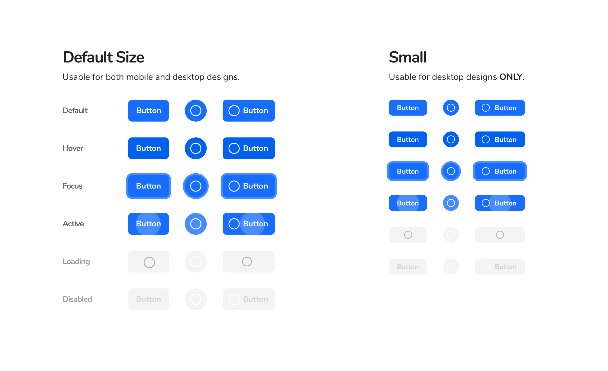
*Primary Button*

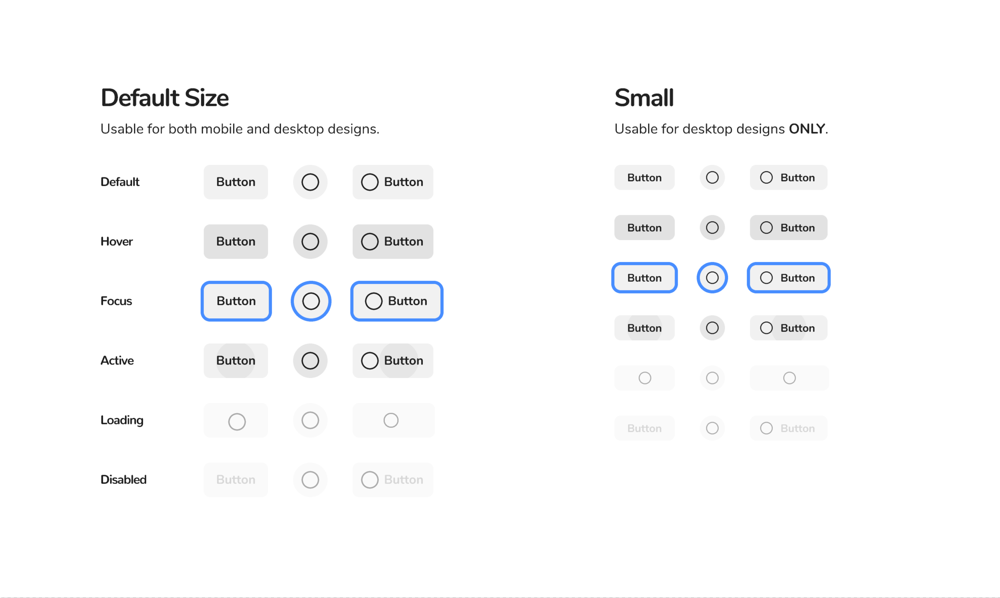
*Secondary Button*

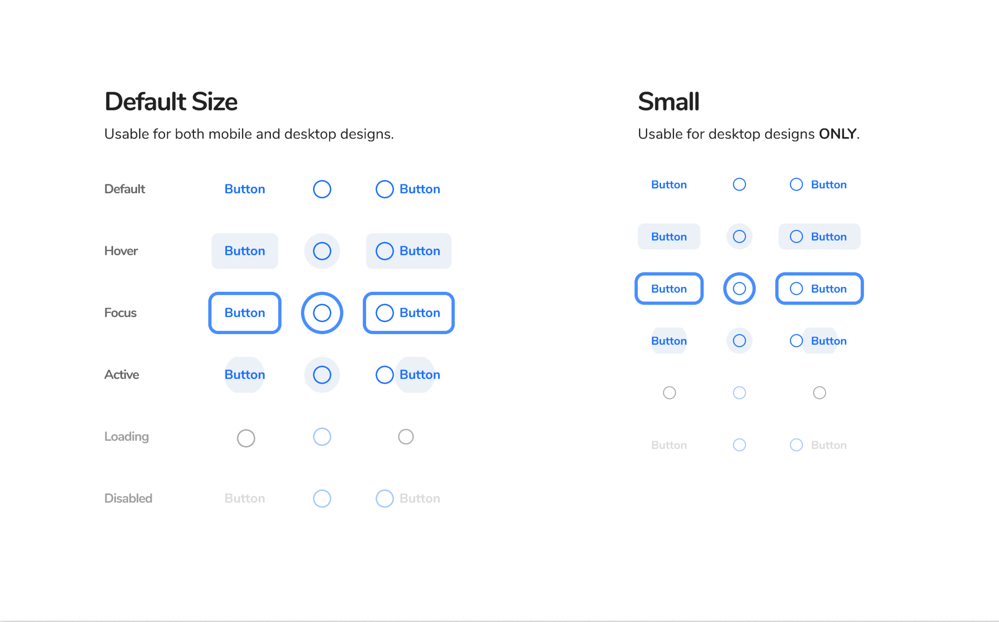
*Tertiary Button*

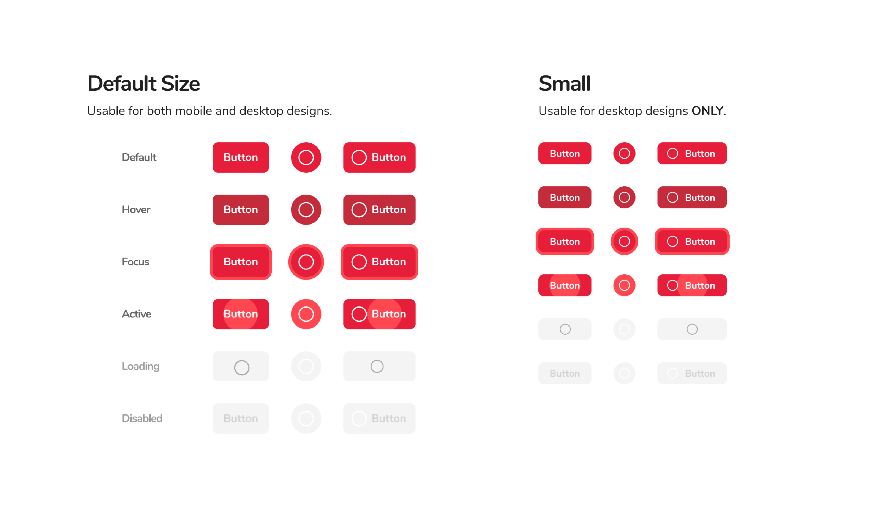
*Danger Button*

## Shadows and Elevation

I created a shadow system that's used to indicate hierarchy (elevation) on the page, with each component having a specific level of elevation. These levels of elevation are broken up into four major surfaces:
- **Base (No Shadow)** — Page Background
- **Raised Low (Level 2)** — Elements with a shadow
- **Raised Medium (Level 6)** — All navigational elements
- **Raised High (Level 12)** — Elements that require immediate action (action sheet, popup, modals, notifications, toasts)

The level is plugged into a formula I created, which makes shadows that are both aesthetic and predictable. In the formula, there are two shadows for each surface and "e" indicates the level of elevation:
- `0 0 2e 0 rgba(0, 0, 0, 0.04)`
- `0 e (3e+8) 0 rgba(0, 0, 0, 0.12)`

The team mutually agreed to use a formula because it's a system that can very easily be updated or modified in the future. If we eventually need more than four surfaces, we can just plug another level into the formula.

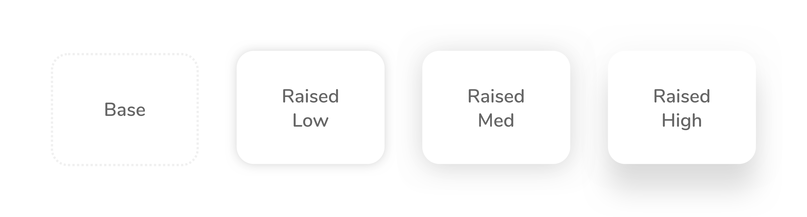
*Shadow and Elevation System*

## Iterating on Elevation

After some time, I realized that certain components, like cards, needed multiple levels of elevation, but that didn't work with the old system. It didn't make sense to assign a single level of elevation because components *can* be and often times *should* be dynamic. Their elevation can change, often times based on some form of user interaction (on tap/click, on scroll, on hover).

So, we built off of the original shadow and elevation system and created new "resting" and "elevated" states for components. We were able to create a diagram that indicated the multiple levels of navigation we desired for singular components.

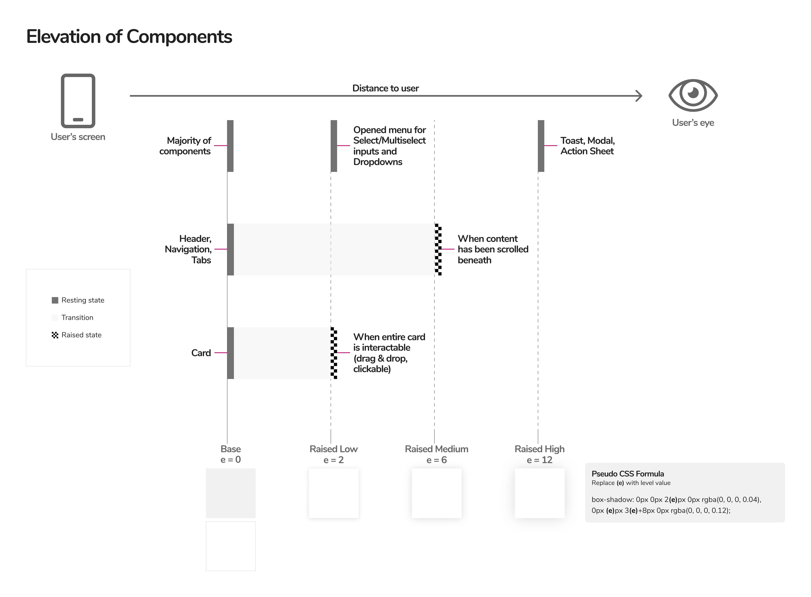
*New Elevation System*

## Navigation

### Tabs

We decided to use tabs for "local" navigation within all of our applications.

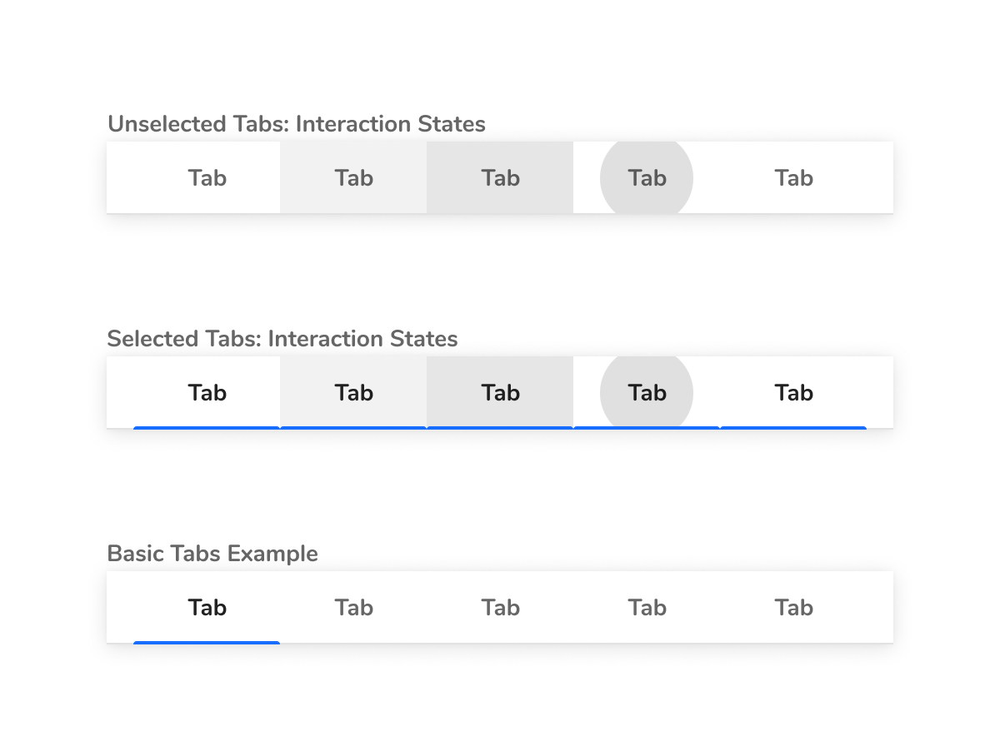
*Tabs*

### Side Nav

For all "global" navigation, we agreed on using a side nav that can expand and collapse.

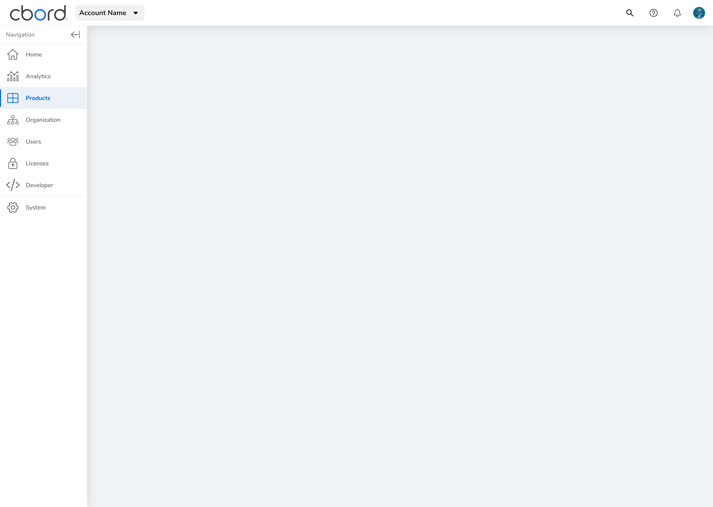
*Side Nav Expanded*

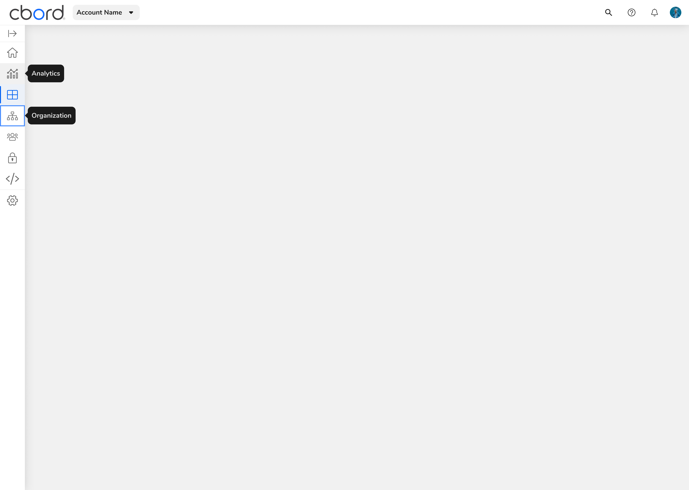
*Side Nav Collapsed*
