import FullWidthImage from "../../components/FullWidthImage.astro";
import doubleDiamond from "../../assets/images/get-app/double-diamond.webp";
import sortingExercise from "../../assets/images/get-app/sorting-exercise.jpg";
import sitemap from "../../assets/images/get-app/sitemap.png";
import loginFlow from "../../assets/images/get-app/login-flow.webp";
import studentId from "../../assets/images/get-app/student-id.png";
import homeMobile from "../../assets/images/get-app/home-mobile.png";
import homeDesktop from "../../assets/images/get-app/home-desktop.jpg";
import accountsFlows from "../../assets/images/get-app/accounts-flows.png";
import mobileAccess from "../../assets/images/get-app/mobile-access.png";
import explore from "../../assets/images/get-app/explore.png";
import rewards from "../../assets/images/get-app/rewards.png";
import conversations from "../../assets/images/get-app/conversations.png";
import usabilityTesting from "../../assets/images/get-app/usability-testing.png";
import ugcBooth from "../../assets/images/get-app/ugc-booth.png";
import orderFlow from "../../assets/images/get-app/order-flow.png";
import addItemFlow from "../../assets/images/get-app/add-item-flow.png";

## My Process

### Double Diamond

<FullWidthImage src={doubleDiamond} alt="Double Diamond Diagram" caption="Double Diamond Diagram - Credit to Eva Schnicker" />

What I like about the double diamond is that it's so flexible. Working in an agile environment, change can happen rapidly. The double diamond is a great tool to look at and ensure I'm taking all the right steps.

## Information Architecture

Due to the modular nature of the app, each feature functions independently, while still being united on the home page.

Very early on in the process I did multiple exercises to further familiarize myself with the product as well as try to reorganize the features in a way that made more sense.

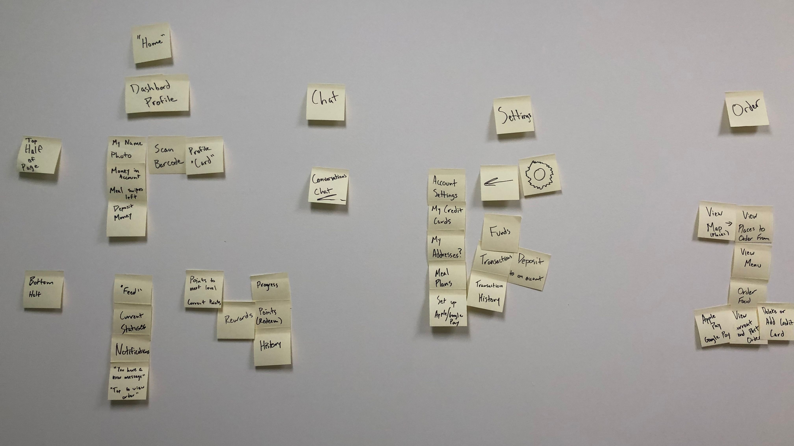
*Early Sorting Exercise*

Eventually, through a lot of trial and error, analytics from the current product, and feedback from an early prototype, I arrived at this sitemap:

<FullWidthImage src={sitemap} alt="Sitemap/flow chart of GET CBORD Student" caption="Sitemap for GET" />

## Login

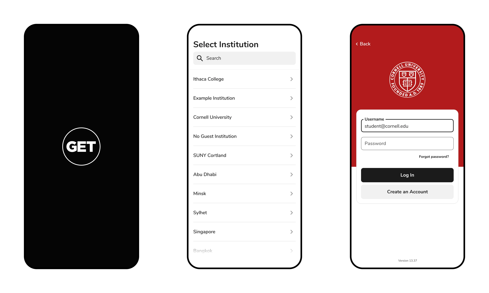
*Login Flow*

## Rethinking the Student ID

Maintaining consistency between the student's ID in their Apple wallet, the GET app, and their physical plastic card was important. I wanted the student to immediately understand that this is essentially the same card as the one they use in person, as well as in iOS. They can add their card to their Apple Wallet as soon as they open the app, and see that their photo ID and the background image of the campus is identical to the card in iOS and physically.

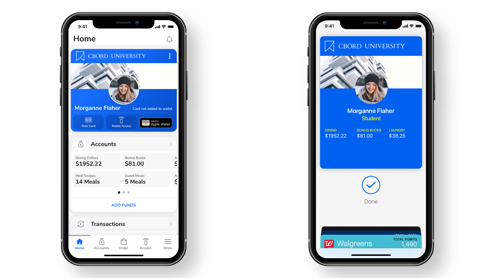
*Student ID in GET vs Student ID in Apple Wallet*

## Home (Dashboard)

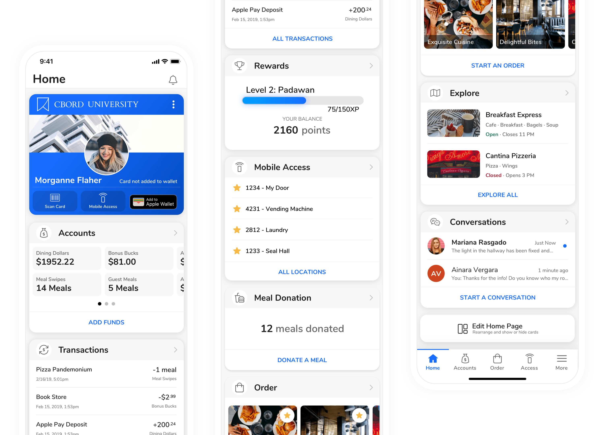
*GET Home Page (Mobile)*

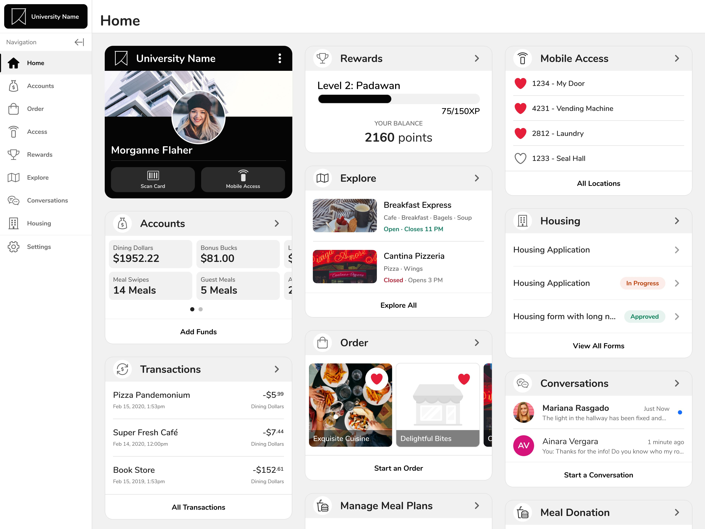
*GET Home Page (Desktop)*

A ton of the functionality in GET was buried away in hard to find places. The home page pulls out the most important information from each feature and presents it to the user in the form of a dashboard.

The position of cards is also completely customizable. Although there are sensible defaults chosen because of analytical data from the existing app, giving the user the choice provides the greatest flexibility.

## Accounts

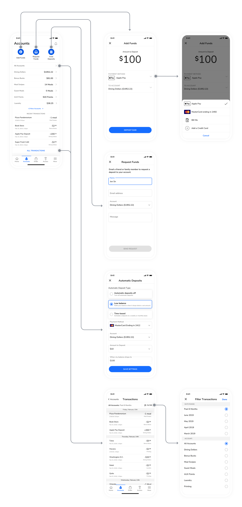
*Core Flows for Accounts*

## Mobile Access

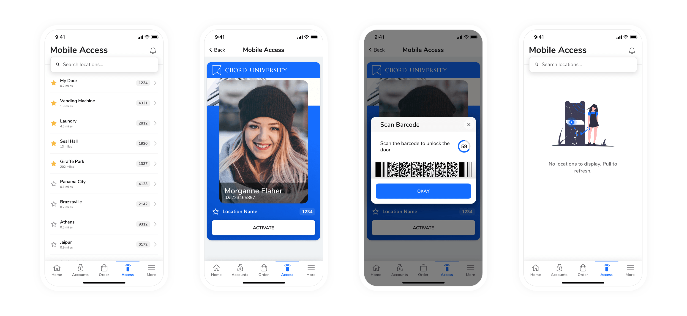
*Main Screens from Mobile Access*

## Explore

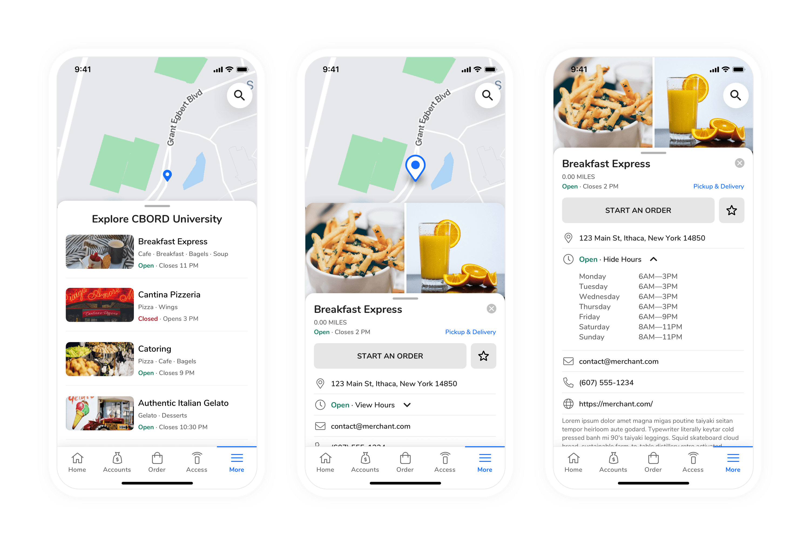
*Main Screens for Explore*

## Rewards

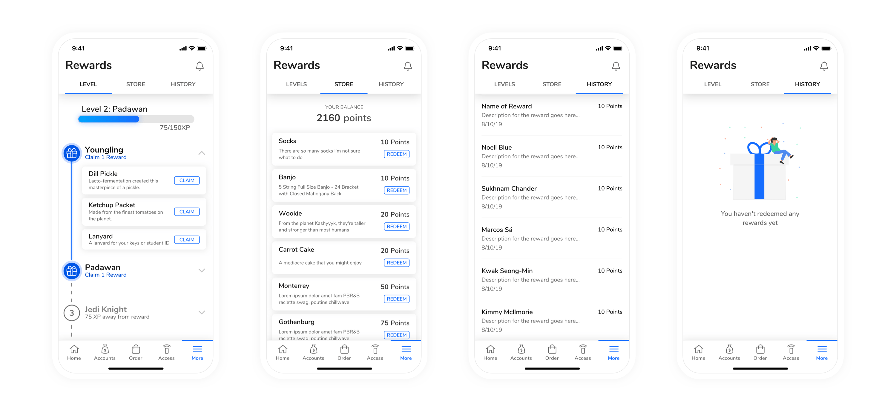
*Main Screens from Rewards*

## Housing

I also mentored an intern through the design of the Housing feature for this app and most all of that work is his. You can check out [his case study on his portfolio](https://www.lrbauer.com/cbord-student).

## Conversations

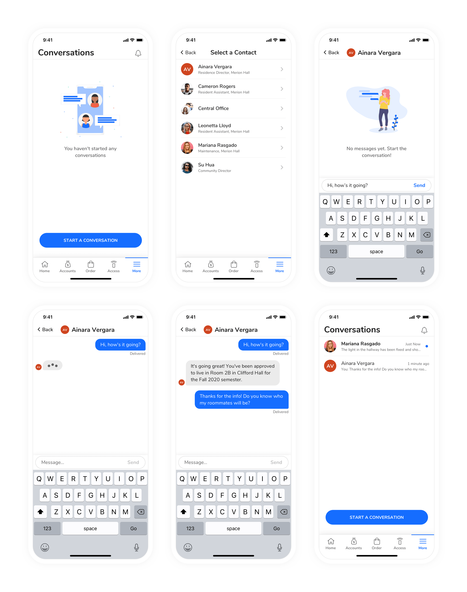
*All Screens for "Conversations"*

## Ordering

### Usability Testing

I facilitated usability testing for the ordering feature with 5 remote participants that were currently enrolled in college. The participants were given tasks and asked to think out loud for the entirety of the test. Each test was conducted remotely using Zoom to talk and so the participant could share their screen. Each participant was given a link to a prototype online and they could choose whether or not to use their phone or a laptop. Each test was recorded and lasted no longer than 30 minutes.

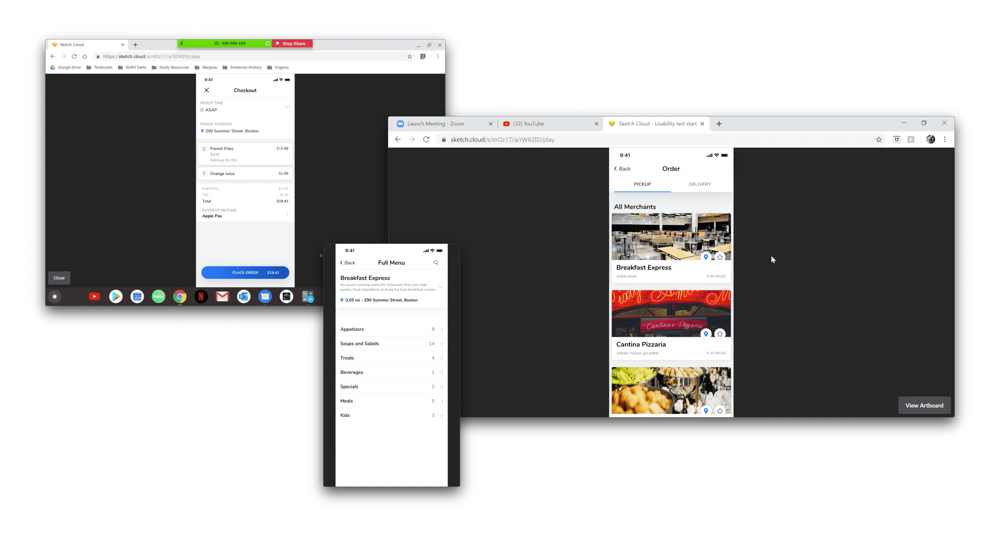
*Screenshots of the Usability Testing*

The most notable pain point for each person was switching between a "Pickup" vs "Delivery" order. The tested design relied on separate tabs for pickup and delivery on the merchants page, prior to even looking at a menu.

To remedy this, I created an "Order Options" modal that prompts the user prior to viewing the menu. It's also re-used in the flow, so if the user wants to change their mind at virtually any point, they can still make changes to their order. This design prevents the user from having to start over like in the original flow.

Other, minor changes were made to the menu as well. The updated design was then tested again at CBORD's annual User Group Conference (UGC). The app was tested with customers, rather than the "typical" demographic for this app, but the testing was valuable nonetheless.

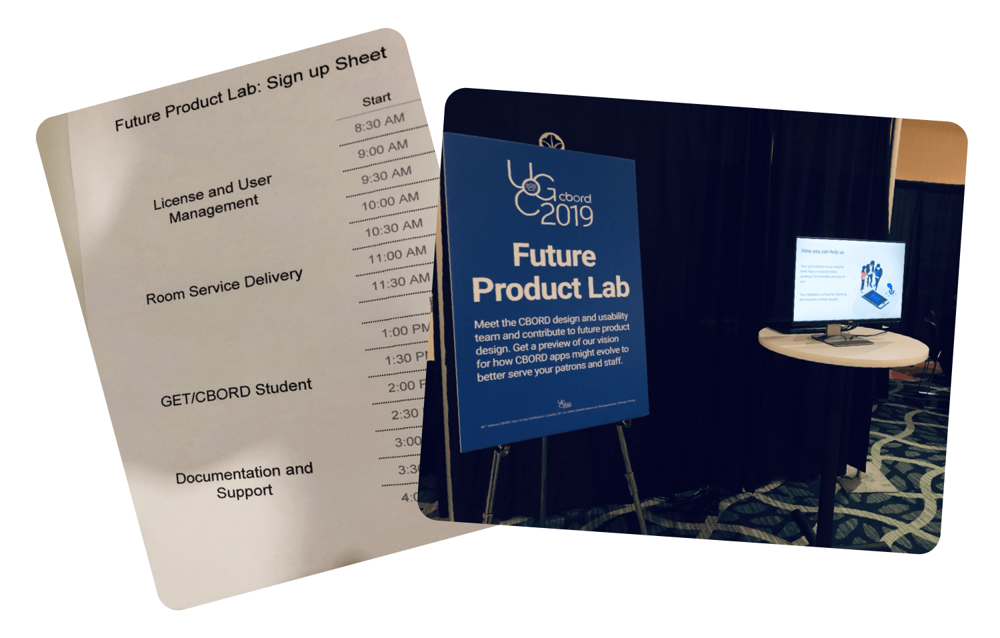
*Usability Testing Booth at UGC 2019*

The usability tests were much more successful in the second iteration of the design. Participants were also asked to complete a SUS (System Usability Scale) questionnaire after the testing. Out of 10 participants, GET had an average SUS score of 81.6/100.

#### "Final" UI Designs for Ordering

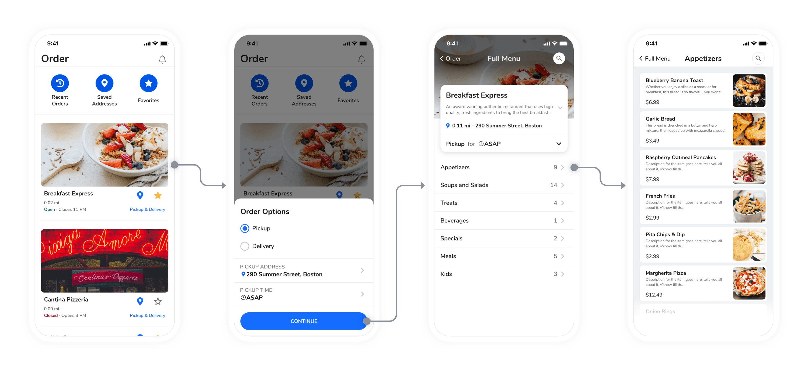
*User Flow for Starting an Order and Viewing the Menu*

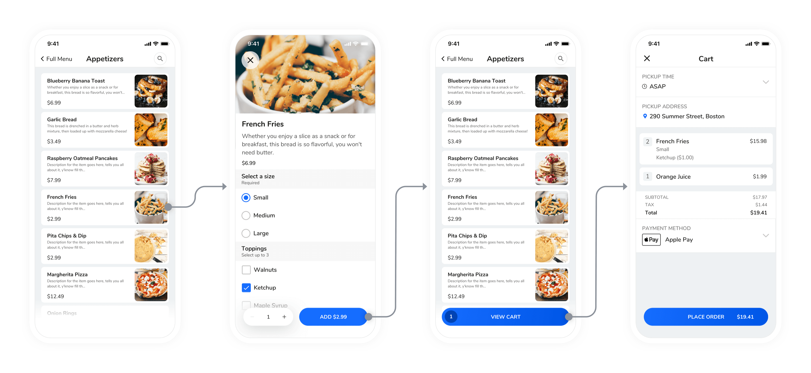
*User Flow for Adding an Item*

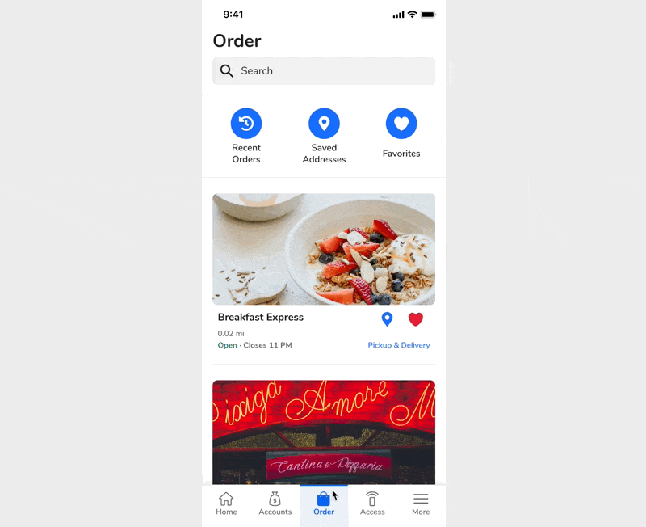
*Order Options Control*
