## Overview

The CBORD Patient App lets patients and their guests order food in a hospital by giving them a menu that is personalized to their diet order and allergens. When I joined the Patient App team, a lot of the functionality was already built. I helped redesign some of the existing core features, but also helped design a new guest ordering feature. I also helped to develop some of the features as well as improve the look and feel of the app as a whole and align it with the up and coming [Aqua Design System](/aqua).

## Usability Testing/Research

I moderated usability testing for the Patient App at CBORD's annual user group conference in October of 2018. Each participant was given a list of tasks: create an account, log in, and place a future order for themselves, as a patient, and for a guest.

This was the first time CBORD or Horizon had *ever* done usability testing on any of its products. It was a large success and helped establish how usability testing might look for the future of the company.

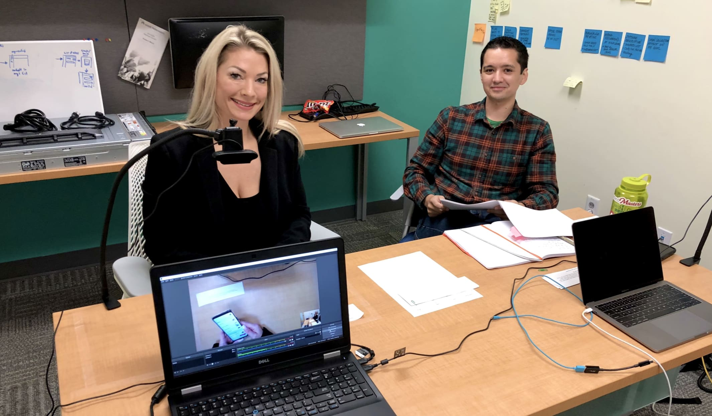
*Internal Usability Testing for the Patient App*

We learned a lot was wrong with our app, here are the more noteworthy findings:
- both registering and logging in were difficult
- the nutrient gauges were often missed entirely or misunderstood
- our expanding/collapsing menu items caused people to think they were adding an item when they tapped on it, even though they still had to tap another button to add it to their order

The majority of the upcoming designs on this page were created as a result of the usability testing.

## Nutrient Gauges Redesign

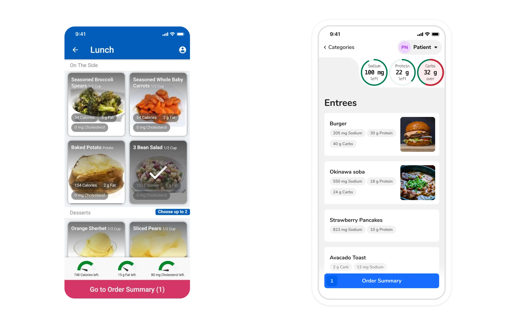
*Nutrient Gauges Before and After*

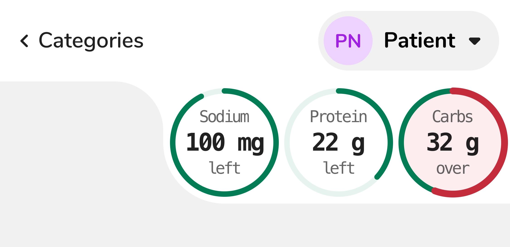
*Nutrient Gauges*

Up to 8% of males are red/green colorblind and 0.5% of females. In order to accommodate all people, there are several different indicators for the nutrient gauge:
- the text within the gauges will read "left" when they haven't reached that limit, and "over" when the patient goes over that limit
- the gauge starts being drawn in red over top of the existing green gauge when over a limit
- background color changes when going over the nutrient limit

This ensures that when someone goes over a specific limit, that gauge will always be more prominent, saturated, and carry more visual weight than a nutrient that is within its limit.

The nutrient gauges were also moved to the top of the screen to further associate them with the patient's profile. These redesigned gauges also let us fit up to four gauges on a phone as opposed to only three gauges in the previous design.

## Item Detail

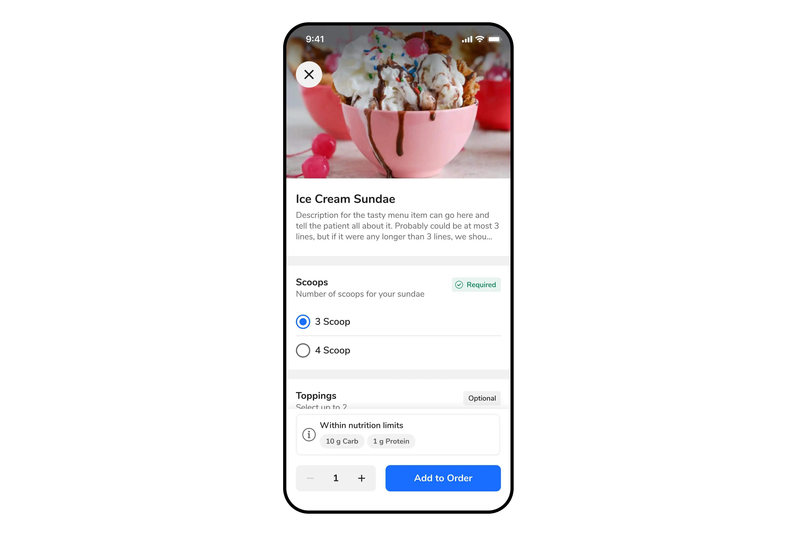
*Item Detail View*

I was able to abstract and share most components of the item detail view between CBORD Patient and the GET App via our Design System. Some shared components included:
- page header
- form sections (checkbox and radio button groups)
- nutrition
- quantity buttons

### Page Header

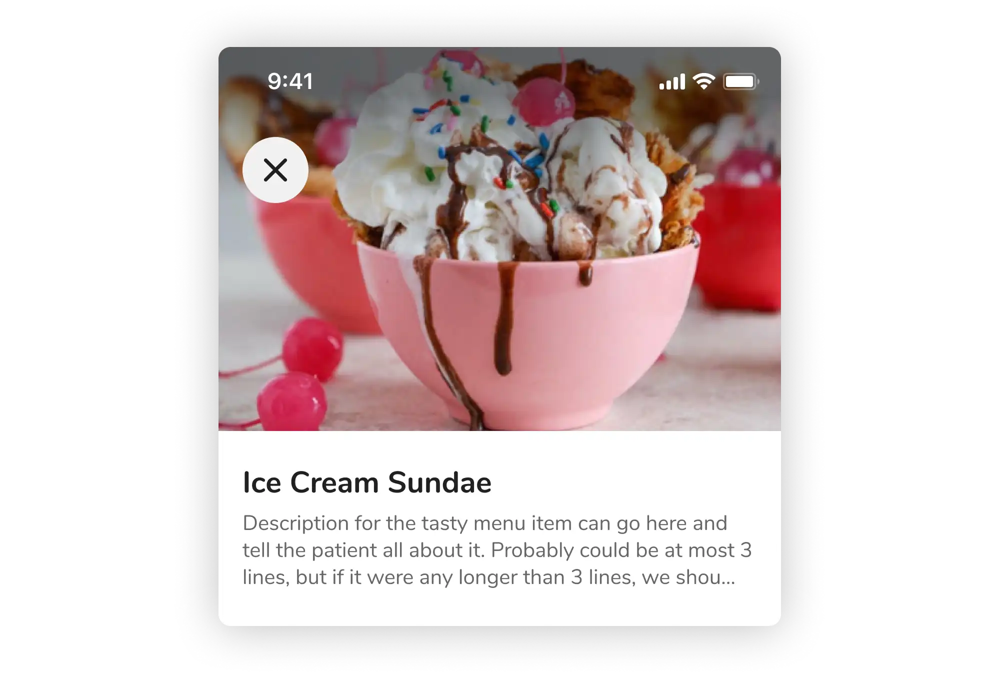
*Page Header Component*

### Form Section

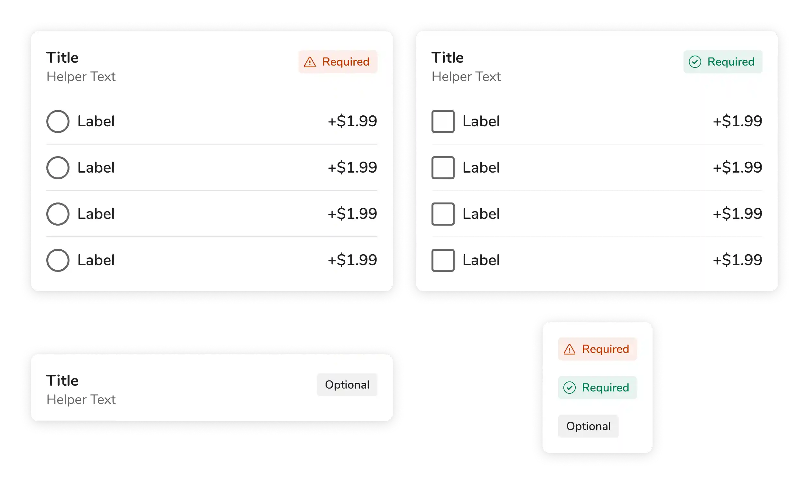
*Form Section Component of the Item Detail View*

### Nutrition Info

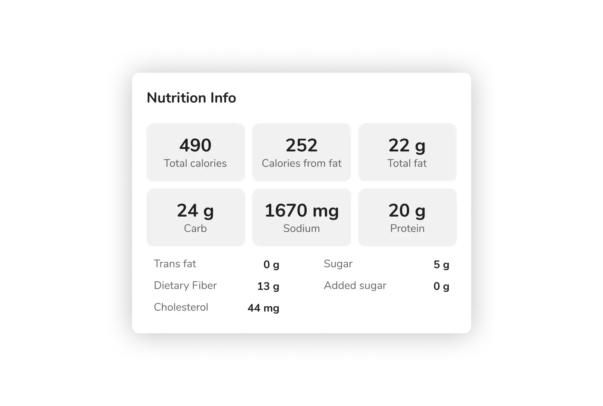
*Nutrition Info Component of the Item Detail View*

## Guest Ordering

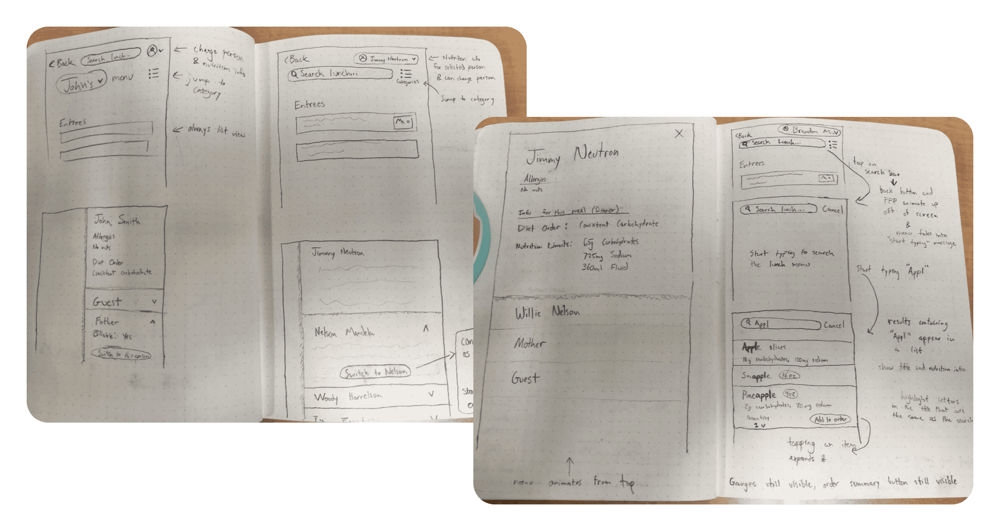
*Early Sketches from Guest Ordering*

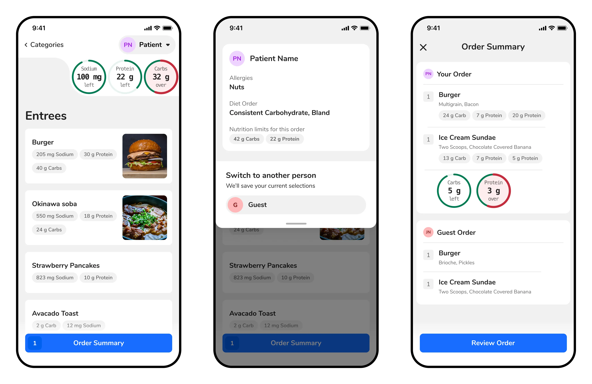
*Core Screens from the Guest Ordering Flow*

## Settings

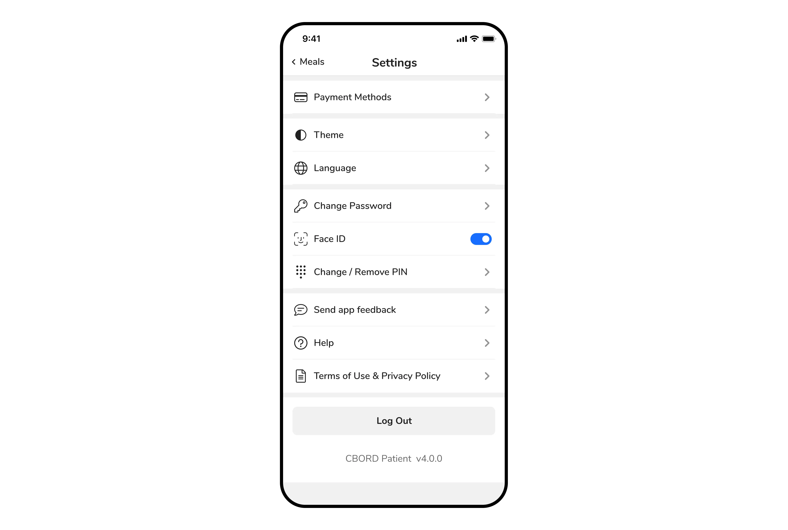
*New Settings Page*

## Login

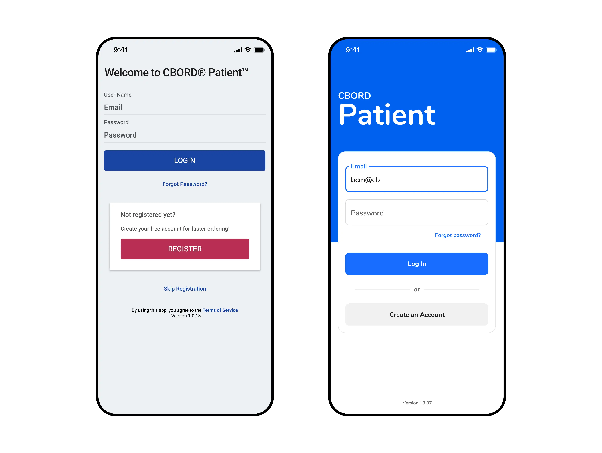
*Login Page Before and After*
